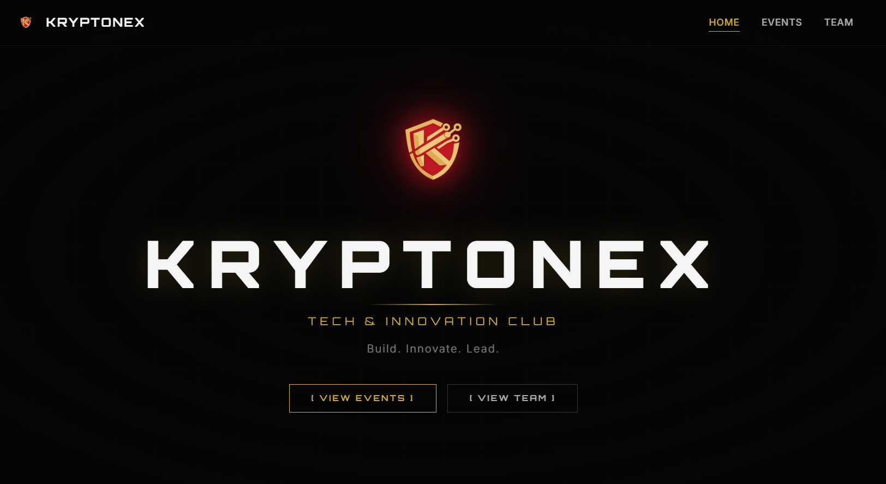

# Kryptonex — Tech & Innovation Club Website

## Live Preview

[](https://kryptonex-website.vercel.app/)

---

## Overview

Kryptonex is a student-driven technology lab website designed to showcase:

- Real-world technical events  
- Club activities and execution-focused culture  
- Upcoming workshops and sessions  
- Team structure and innovation ecosystem  

The website is built with modern UI/UX principles, smooth animations, and performance-focused design.

---

## Tech Stack

- React + Vite  
- Tailwind CSS  
- Framer Motion  
- Vercel (Deployment)  

---

## Features

### Hero Section
- Animated logo with particle effects  
- Smooth text reveal animations  
- Cinematic interaction design  

---

### About Section
- Scroll-triggered animations  
- Count-up statistics for members and events  
- Execution-focused messaging  

---

### Events System

#### Upcoming Event
- GitSetGo — Master Git & GitHub  
- Includes instructor details and session timing  

#### Past Events
- Blockchain Podcast  
- Tech Rush (DSA, Debugging, Final Round)  
- Ethical Hacking Workshop  

---

### Navigation
- Scroll-based navigation  
- Active section highlighting  
- Smooth transitions  

---

### UI/UX Design
- Dark theme with gold accents  
- Subtle grid and glow effects  
- Fully responsive layout  

---

## Key Concepts Used

- Component-based architecture  
- Scroll-triggered animations  
- Intersection Observer  
- State-driven UI rendering  
- Performance optimization  

---

## Stats

- 38 Active Members  
- 3 Events Completed  
- 1 Upcoming Session  

---

## Getting Started

```bash
git clone https://github.com/your-username/kryptonex-website.git
cd kryptonex-website
npm install
npm run dev
